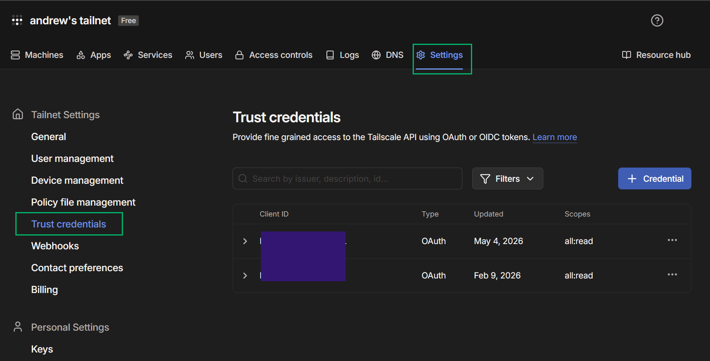
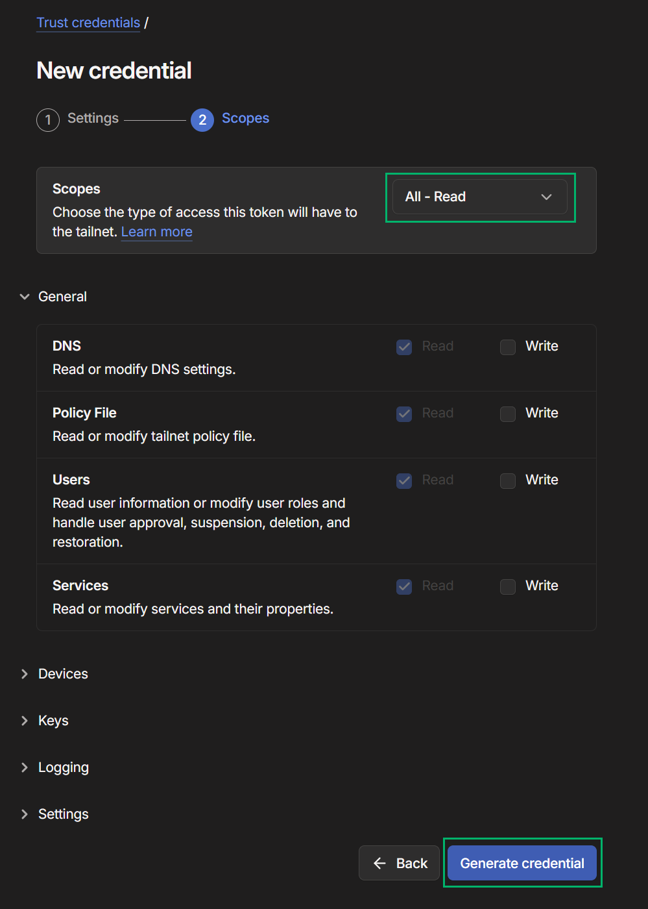
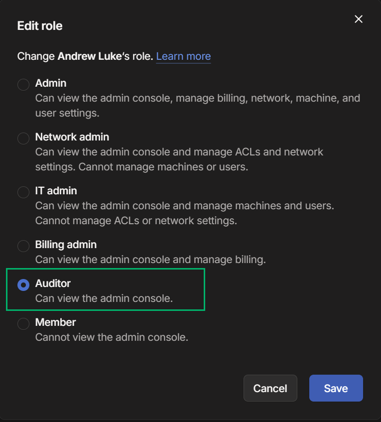
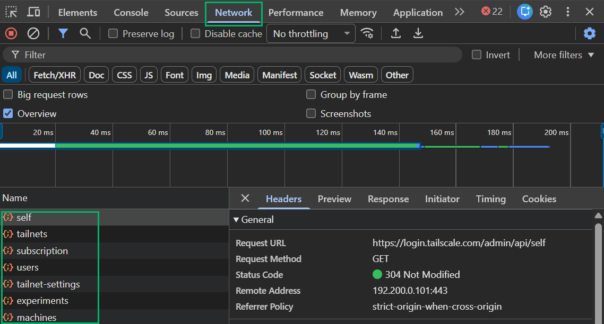
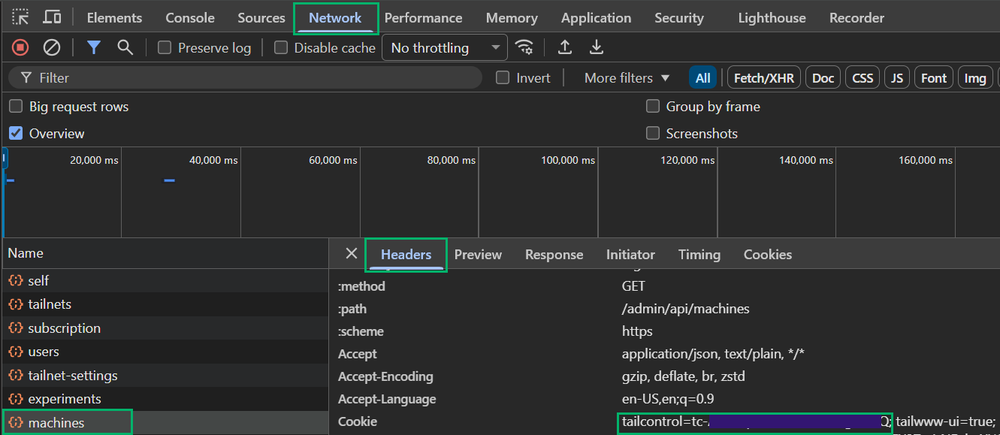

# TailscaleHound

TailscaleHound is a BloodHound OpenGraph collector for Tailscale. It collects tailnet users, devices, groups, tags, ACLs, grants, SSH rules, routes, app connectors, services, invites, webhooks, and related control-plane metadata, then emits a BloodHound-compatible OpenGraph JSON file.

The goal is to make Tailscale access relationships visible as graph paths:

```cypher
MATCH p=(u:TS_User)-[:TS_IsMemberOf]->(s)-[:TS_AclSource|TS_GrantSource]->(r)-[:TS_AclTargetsDevice|TS_GrantTargetsDevice]->(d:TS_Device)
RETURN p
```

Thank you to [@Sw4mpf0x](https://github.com/Sw4mpf0x) for helping create this tool and the inspiration: https://specterops.io/blog/2026/03/12/leveraging-tailscale-keys/

## Features

- Remote collection through the Tailscale API.
- Local collection from `tailscale status --json` output.
- Azure hybrid attack path mapping through `TS_AZUserSyncedToUser`.

## Current Coverage

TailscaleHound currently defines 38 node kinds and 63 relationship kinds.

Primary node kinds include:

| Area | Node kinds |
| --- | --- |
| Tailnet | `TS_Network`, `TS_IDP`, `TS_ExternalTailnet` |
| Identities | `TS_User`, `TS_ExternalUser`, `TS_Group`, `TS_AutoGroup`, `TS_Tag`, `TS_ExternalTag`, `TS_Wildcard` |
| Devices | `TS_Device`, `TS_ExternalDevice`, `TS_Route`, `TS_Cidr`, `TS_HostAlias` |
| Policy | `TS_ACL`, `TS_Grant`, `TS_SSHRule`, `TS_ACLTest`, `TS_SSHTest`, `TS_PortSpec` |
| Posture | `TS_Posture`, `TS_DefaultSrcPosture`, `TS_NodeAttr`, `TS_Attr` |
| Tailnet objects | `TS_APIKey`, `TS_AuthKey`, `TS_ClientKey`, `TS_FederatedKey`, `TS_UnknownKey`, `TS_Service`, `TS_AppConnector`, `TS_Webhook`, `TS_UserInvite`, `TS_DeviceInvite` |

Primary relationship groups include:

| Area | Relationship examples |
| --- | --- |
| Identity and roles | `TS_IsMemberOf`, `TS_IsOwnerOf`, `TS_IsAdminOf`, `TS_IsNetworkAdminOf`, `TS_IsITAdminOf` |
| Devices | `TS_RegisteredDevice`, `TS_HasTag`, `TS_EnabledRoute`, `TS_IsExitNode` |
| ACLs and grants | `TS_AclSource`, `TS_AclTargetsDevice`, `TS_GrantSource`, `TS_GrantTargetsRoute`, `TS_RequiresPosture` |
| SSH | `TS_SSHRuleSource`, `TS_SSHRuleTargetsDevice`, `TS_SSHRuleTargetsSelf`, `TS_SSHRuleAllowsUser` |
| Funnel and services | `TS_HasFunnelCapabilities`, `TS_HasFunnelEnabled`, `TS_HasService`, `TS_ServiceRunsOn`, `TS_ServiceHasTag` |
| Hybrid identity | `TS_AZUserSyncedToUser` |

## Installation

```bash
git clone https://github.com/KingOfTheNOPs/TailscaleHound.git
cd TailscaleHound

python3 -m venv .venv
source .venv/bin/activate
pip3 install -r requirements.txt
```

You can run the collector either through the root launcher:

```bash
python3 TailscaleHound.py --help
```

Or install the package locally to use the `tailscalehound` console entry point:

```bash
pip3 install -e .
tailscalehound --help
```

## Authentication

### Tailscale OAuth Client

OAuth client credentials are also supported:

```bash
python3 TailscaleHound.py \
  --ts-client-id "$TAILSCALE_CLIENT_ID" \
  --ts-oauth-secret "$TAILSCALE_OAUTH_SECRET" \
  --output ./tailscalehound-output
```

To generate an OAuth token, login to [Tailscale](https://login.tailscale.com/) as an Owner, Admin, IT Admin or Network Admin. Browse to settings -> Trust Credentials -> + Credential...



Provide the key read only across all resources



### Tailscale API Key

Use a Tailscale API key when you want the remote collector to pull data directly from the Tailscale API:

```bash
python3 TailscaleHound.py \
  --ts-api-key "$TAILSCALE_API_KEY" \
  --output ./tailscalehound-output
```

I don't recommend this option, but if you need a [Tailscale API Key](https://tailscale.com/docs/reference/tailscale-api). Login to [Tailscale](https://login.tailscale.com/) as an Owner, Admin, IT Admin or Network Admin. Browse to settings -> Keys -> Generate access tokens...

### Local Tailscale Status

Local collection starts from the Tailscale client status JSON. This is useful for quick device/session visibility. When API access is not available, you can also provide an exported Tailscale Access Policy file to add the same ACL, grant, SSH, group, tag, posture, and app connector graph enrichment used by remote collection.

```bash
tailscale status --json > tailscale-status.json

python3 TailscaleHound.py \
  --status-file tailscale-status.json \
  --access-policy-file access-policy.json \
  --output ./tailscalehound-output
```

### Optional Admin-Panel Enrichment

Some useful fields are not available from the public API paths this collector uses. If you provide a `tailcontrol` cookie, TailscaleHound will try to enrich the graph with admin-panel machine, user, key, identity provider, billing, and settings data.

As a result, I recommend creating/granting a user with the Auditor role in order to run this tool with full visibilty into the network. To grant this role to a user, login with an Owner, Admin, or IT admin account and go to [Users](https://login.tailscale.com/admin/users) panel, select the `...` next to the user and select `Edit Role`. Grant them the Auditor role to give them read only access to the admin console. 



To obtain a tailcontrol cookie, open your browser and launch the Network tab in the DevTool console by selecting F-12. Login to [Tailscale](https://login.tailscale.com) and look for any network call to the `/admin/api` endpoint such as `self`, `tailnets`, etc. 



Select one of those calls, such as `machines` and inspect grab your `tailcontrol` cookie from the Headers tab under to Cookie section



Use the tailcontrol cookie and OAuth credentials to enumerate the Tailscale environment:

```bash
python3 TailscaleHound.py \
  --ts-client-id "$TAILSCALE_CLIENT_ID" \
  --ts-oauth-secret "$TAILSCALE_OAUTH_SECRET"\
  --tailcontrol "$TAILCONTROL_COOKIE" \
  --output ./tailscalehound-output
```

Treat this cookie like a credential. It is sensitive and should not be committed, pasted into logs, or shared.

Admin-panel enrichment currently adds or fills the following fields beyond the public API responses used by the collector:

| Area | Additional fields |
| --- | --- |
| Users | `UserID`, `StableID`, `IsAdmin`, `IsOwner`, `OrgTailnetID`, `DomainName`, `SharedDomain`, `CanEditBilling`, `NeedsOnboarding`, `UseBusinessPricing`, `NoLongerProvisioned` |
| Devices | `StableID`, `FQDN`, `MachineName`, `OSVersion`, `ParsedOSVersion`, `IPNVersion`, `Creator`, `Domain`, `AvailableUpdateVersion`, `AutomaticNameMode`, `AutoUpdatesEnabled`, `CanNat`, `Endpoints`, `ExtraIPs`, `AllowedTags`, `InvalidTags`, `AdvertisedIPs`, `AcceptedShareCount`, `ShareID`, `HasExitNode`, `AdvertisedExitNode`, `AllowedExitNode`, `HasSubnets`, `SSHUsernames`, `OtherSSHUsernamesAllowed`, `FunnelEnabled`, `NeverExpires` |
| Keys | `Creator`, `Invalid`, `AuthKey`, `ApiKey`, `OAuthClient`, OAuth `Scopes` |
| Tailnet settings | Admin settings such as identity provider metadata, plus `StripeSubscription` and `StripeBillingUsage` |


## BloodHound Setup

### 1. Upload the OpenGraph Schema

Upload `schema.json` to BloodHound through OpenGraph Extension Management, or use the helper script:

```bash
python3 helper-scripts/upload_schema.py \
  --url https://bloodhound.example.com \
  --username admin \
  --secret "$BLOODHOUND_SECRET"
```

The schema uses:

- Namespace: `TS`
- Environment kind: `TS_Network`
- Common query entry point: `MATCH (n:TS_User) RETURN n`

### 2. Upload Custom Node Types

The optional `custom_types.json` file configures display icons and colors for TailscaleHound node kinds.

```bash
python3 helper-scripts/upload_custom_icons.py \
  --url https://bloodhound.example.com \
  --username admin \
  --secret "$BLOODHOUND_SECRET"
```

> [!WARNING]
> the current helper removes existing custom node types returned by BloodHound before uploading `custom_types.json`. Use it carefully on shared BloodHound instances.

### 3. Upload Saved Queries

TailscaleHound ships saved queries under `SavedQueries/`.

```bash
python3 helper-scripts/upload_saved_queries.py \
  --url https://bloodhound.example.com \
  --username admin \
  --secret "$BLOODHOUND_SECRET"
```

> [!WARNING]
> this helper deletes the authenticated user's existing saved queries before recreating the TailscaleHound query set.

### 4. Upload Collector Output

The collector requires `--output` and writes generated files to that directory, creating it when needed.

Remote collection output:

```text
<output>/tailscalehound_remote_opengraph_<timestamp>_output.json
<output>/tailscalehound_remote_acl_<timestamp>_policy.json
```

Local collection output:

```text
<output>/tailscalehound_local_opengraph_<timestamp>_output.json
```

Upload the generated OpenGraph JSON through BloodHound file ingest.

You can also upload one or more generated JSON files with the helper script:

```bash
python3 helper-scripts/upload_ingest_files.py \
  --url https://bloodhound.example.com \
  --username admin \
  --secret "$BLOODHOUND_SECRET" \
  ./tailscalehound-output/tailscalehound_local_opengraph_<timestamp>_output.json
```

The helper starts a BloodHound file-upload job, uploads each JSON file, ends the job, then prints job status until ingestion reaches a completed or failed terminal state. Use `--poll-interval` and `--poll-timeout` to tune how long it waits.

## Usage

### Remote Collection

```bash
python3 TailscaleHound.py \
  --ts-api-key "$TAILSCALE_API_KEY" \
  --output ./tailscalehound-output \
  --verbose
```

Remote collection pulls users, devices, routes, keys, webhooks, DNS settings, logging settings, services, invites, contacts, tailnet settings, and the ACL policy where available.

Device registration edges are derived from the Tailscale device `user` field. Tailscale describes that field as the user who registered the node; for untagged nodes, that user is the device owner. TailscaleHound models this as `(:TS_User)-[:TS_RegisteredDevice]->(:TS_Device)` instead of treating it as an active session.

### Local Collection

```bash
tailscale status --json > tailscale-status.json

python3 TailscaleHound.py \
  --status-file tailscale-status.json \
  --access-policy-file access-policy.json \
  --output ./tailscalehound-output \
  --verbose
```

Local collection can observe devices shared from other tailnets. When a user appears only through external devices, TailscaleHound models that identity as `TS_ExternalUser` and links it indirectly to the external tailnet through `(:TS_ExternalUser)-[:TS_RegisteredDevice]->(:TS_ExternalDevice)-[:TS_InExternalTailnet]->(:TS_ExternalTailnet)`. Tags observed on shared devices are scoped as `TS_ExternalTag` through `TS_HasExternalTag`; they are not merged with local `TS_Tag` policy nodes. The synthetic `tagged-devices` identity from local status output is not emitted as a user node; tagged tailnet devices are represented through their `TS_HasTag` relationships.

### Hybrid Azure Mapping

If Azure and TailscaleHound data already exist in BloodHound, TailscaleHound can create `AZUser -> TS_User` bridge edges by matching `AZUser.userPrincipalName` to `TS_User.LoginName`.

```bash
python3 TailscaleHound.py \
  --hybrid-attacks Windows \
  --bh-url https://bloodhound.example.com \
  --bh-user admin \
  --bh-password "$BLOODHOUND_SECRET" \
  --output ./tailscalehound-output
```

You can add `--opengraph ./tailscalehound-output/tailscalehound_remote_opengraph_<timestamp>_output.json` to build the bridge before TailscaleHound data has been ingested into BloodHound.

Example Hybrid Attack Path:


## Example Queries

Reference [SavedQueries](SavedQueries) for a complete list of queries:


List Tailscale users:

```cypher
MATCH (n:TS_User)
RETURN n
```

Find devices registered by users:

```cypher
MATCH p=(u)-[:TS_RegisteredDevice]->(d)
WHERE (u:TS_User OR u:TS_ExternalUser)
  AND (d:TS_Device OR d:TS_ExternalDevice)
RETURN p
```

Find external users through shared external devices:

```cypher
MATCH p=(u:TS_ExternalUser)-[:TS_RegisteredDevice]->(d:TS_ExternalDevice)-[:TS_InExternalTailnet]->(t:TS_ExternalTailnet)
RETURN p
```

Find tags observed on shared external devices:

```cypher
MATCH p=(d:TS_ExternalDevice)-[:TS_HasExternalTag]->(t:TS_ExternalTag)
RETURN p
```

Find group-based device access through ACLs and grants:

```cypher
MATCH p=(u:TS_User)-[:TS_IsMemberOf]->(s)-[:TS_AclSource|TS_GrantSource]->(r)-[:TS_AclTargetsDevice|TS_GrantTargetsDevice]->(d)
RETURN p
```

Find direct user access to devices:

```cypher
MATCH p=(u:TS_User)-[:TS_AclSource|TS_GrantSource]->(r)-[:TS_AclTargetsDevice|TS_GrantTargetsDevice]->(d)
RETURN p
```

Find SSH rule paths and allowed SSH users:

```cypher
MATCH p1=(u:TS_User)-[:TS_IsMemberOf]->(s)-[:TS_SSHRuleSource]->(r:TS_SSHRule)-[:TS_SSHRuleTargetsDevice]->(d:TS_Device)
MATCH p2=(r)-[:TS_SSHRuleAllowsUser]->(ssh:TS_SSHUser)
RETURN p1, p2
```

Find enabled Funnel devices:

```cypher
MATCH p=(d:TS_Device)-[:TS_HasFunnelEnabled]->(n:TS_Network)
RETURN p
```

Find Azure-to-Tailscale device access:

```cypher
MATCH p=(az:AZUser)-[:TS_AZUserSyncedToUser]->(u:TS_User)-[:TS_IsMemberOf]->(s)-[:TS_AclSource|TS_GrantSource]->(r)-[:TS_AclTargetsDevice|TS_GrantTargetsDevice]->(d)
RETURN p
```

## Traversable Edges

BloodHound pathfinding uses the `is_traversable` flag in `schema.json`. TailscaleHound currently marks these relationship kinds as traversable:

```text
TS_AZUserSyncedToUser
TS_AclSource
TS_AclTargetsAppConnector
TS_AclTargetsDevice
TS_AclTargetsExitNode
TS_AclTargetsRoute
TS_GrantSource
TS_GrantTargetsAppConnector
TS_GrantTargetsDevice
TS_GrantTargetsExitNode
TS_GrantTargetsRoute
TS_HasFunnelCapabilities
TS_HasFunnelEnabled
TS_HasTag
TS_IsAdminOf
TS_IsITAdminOf
TS_IsMemberOf
TS_IsNetworkAdminOf
TS_IsOwnerOf
TS_RegisteredDevice
TS_SSHRuleSource
TS_SSHRuleTargetsDevice
TS_SSHRuleTargetsSelf
```

ACL tests, SSH tests, ports, posture requirements, default posture, webhooks, invites, services, billing admin, auditor, app connector runtime placement, auto approvers, key creation metadata, and external tailnet metadata are currently modeled as non-traversable context.

## Environment Variables

TailscaleHound loads `.env` and process environment variables. CLI arguments take precedence over environment variables.

```bash
TAILSCALEHOUND_OUTPUT=./tailscalehound-output
TAILSCALE_API_KEY=tskey-example
TAILSCALE_TAILNET=example.com
TAILCONTROL_COOKIE=optional_tailcontrol_cookie

# OAuth alternative to TAILSCALE_API_KEY
TAILSCALE_CLIENT_ID=your_oauth_client_id
TAILSCALE_OAUTH_SECRET=your_oauth_client_secret

# Local collection alternative to remote credentials
TAILSCALEHOUND_STATUS=./tailscale-status.json
TAILSCALEHOUND_ACCESS_POLICY=./access-policy.json

# BloodHound values used by helper scripts and hybrid mapping
BLOODHOUND_URL=https://bloodhound.example.com
BLOODHOUND_USERNAME=admin
BLOODHOUND_SECRET=your_secret_here
```

Supported main collector variables include `TAILSCALEHOUND_OUTPUT`, `TAILSCALEHOUND_STATUS`, `TAILSCALEHOUND_ACCESS_POLICY`, `TAILSCALEHOUND_ACCESS_POLICY_FILE`, `TAILSCALE_API_KEY`, `TAILSCALE_CLIENT_ID`, `TAILSCALE_OAUTH_SECRET`, `TAILSCALE_TAILNET`, `TAILSCALE_API_BASE_URL`, `TAILCONTROL_COOKIE`, `TAILSCALE_TAILCONTROL`, `TAILSCALEHOUND_INCLUDE_NETWORK_LOGS`, `TAILSCALEHOUND_INSECURE`, `TAILSCALEHOUND_VERBOSE`, and `TAILSCALEHOUND_DEBUG`.

Hybrid mapping also supports `TAILSCALEHOUND_HYBRID_ATTACKS`, `BLOODHOUND_URL`, `BLOODHOUND_USERNAME`, and `BLOODHOUND_SECRET`. `TAILSCALEHOUND_FILE` is optional for pre-ingest or offline hybrid mapping.

## Output Files

| File | Purpose |
| --- | --- |
| `<output>/tailscalehound_remote_opengraph_<timestamp>_output.json` | Remote API OpenGraph output |
| `<output>/tailscalehound_local_opengraph_<timestamp>_output.json` | Local status OpenGraph output, enriched with Access Policy data when supplied |
| `<output>/tailscalehound_remote_acl_<timestamp>_policy.json` | Raw ACL policy snapshot from remote collection |
| `<output>/tailscale_hybrid_paths_<timestamp>.json` | Azure-to-Tailscale bridge output |

## Helper Scripts

| Script | Purpose |
| --- | --- |
| `helper-scripts/upload_schema.py` | Upload the OpenGraph extension schema from `schema.json` |
| `helper-scripts/upload_ingest_files.py` | Upload one or more BloodHound collection JSON files for ingest |
| `helper-scripts/upload_custom_icons.py` | Upload custom BloodHound node type icons from `custom_types.json` |
| `helper-scripts/upload_saved_queries.py` | Sync saved Cypher queries from `SavedQueries/` |
| `helper-scripts/sync_azuser_tailscale.py` | Create `TS_AZUserSyncedToUser` edges from existing BloodHound `AZUser` data |
| `helper-scripts/clear_database.py` | Clear BloodHound collected graph data and ingest history |
| `helper-scripts/fetch_admin_machines.py` | Manually fetch the admin-panel machines response for enrichment research 

> [!WARNING]
> `helper-scripts/clear_database.py` is destructive. Use it only against BloodHound instances where deleting collected data is intended.


## Limitations

- Local collection cannot infer service or invite relationships from status data. ACL, grant, SSH, posture, and app connector relationships require `--access-policy-file` when using `--status-file`.
- Tailscale API coverage depends on the token's permissions and the tailnet plan/features available.
- Some admin-panel enrichment relies on undocumented endpoints and may change without warning.
- Policy edges are modeled from configuration. Whether access succeeds at runtime may still depend on posture checks, device state, route advertisement, network reachability, or Tailscale feature state.
- Tag ownership and auto approvers are currently represented as context rather than direct traversable attack paths.

## Roadmap

- [ ] Expand role modeling based on Tailscale user-role permissions.
- [ ] Add explicit capability edges for tag assignment and auto approval.
- [ ] Improve posture compliance analysis.
- [ ] Expand third-party identity provider mapping.
